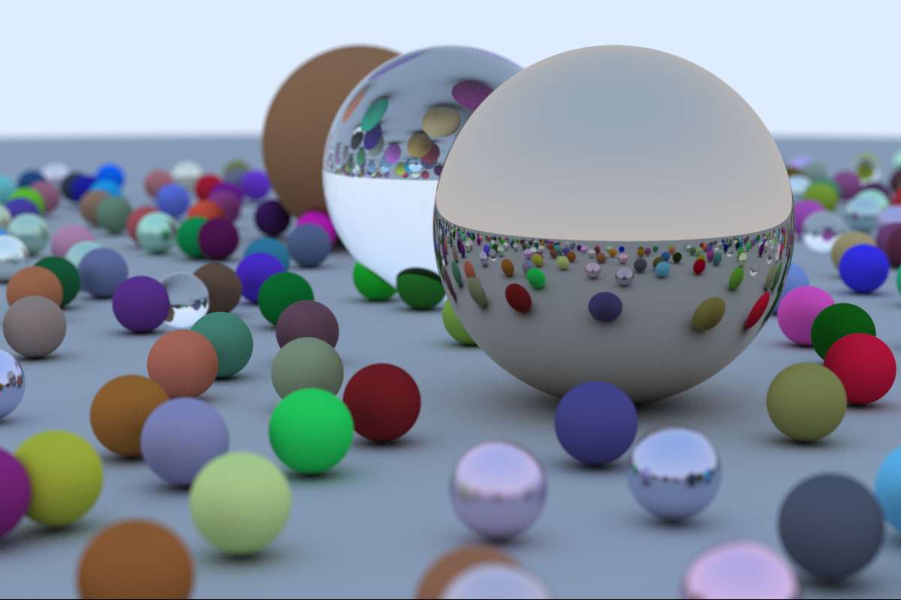

# PyTrace_Weekend

A (nearly) pure Ray Tracing Project for Python

This work is based off the books **[Ray Tracing in One Weekend](https://github.com/RayTracing/raytracinginoneweekend)** but ported to python 

#### To run, simply run pypy3 main.py or python main.py

dependencies include: 
1. pypy3 (note all other dependencies must be installed within pypy3)
2. numpy 
3. matplotlib
4. tqdm
5. noise

Technically, you can run w/o pypy3 installed but it is very slow w/o the JIT compilation, as seen below 

## PyTrace_Weekend Benchmark:
Note: Iterations per second are how many pixels 

### W/ current scene: 
256 spp 

1200 x 800 

3 Large spheres

Standard implementation

avg:  73.34 it/s 

time: 4:10:06

### W/ current scene: 
256 spp 

1200 x 800 

3 Large spheres

Standard implementation w/PyPy

avg:  4953.02 it/s 

time: 00:03:13  

### W/ current scene: 
100 spp 

200 x 100

3 Large spheres

Standard implementation

avg: 179.90 it/s

time: 00:01:50

### W/ current scene
100 spp 

200 x 100 

3 Large spheres

Standard implementation w/ PyPy

avg: 10819.22 it/s

time: 00:00:01

### W/ random scene: 
256 spp 

1200 x 800 

3 Large spheres + random spheres

Standard implementation w/PyPy

avg:  307.16 it/s

time: 00:52:01 

### W/ random scene:
64 spp

200 x 100 

3 Large spheres + random spheres

Standard implementation w/PyPy w/o cprofile

avg: 1207.04it/s

time: 00:00:06
